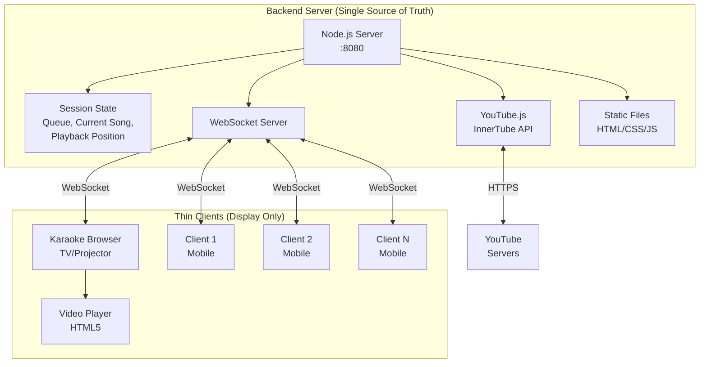
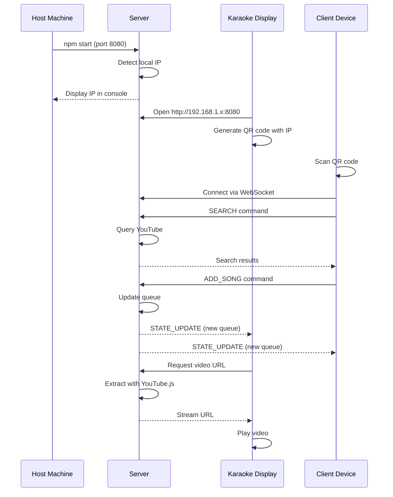
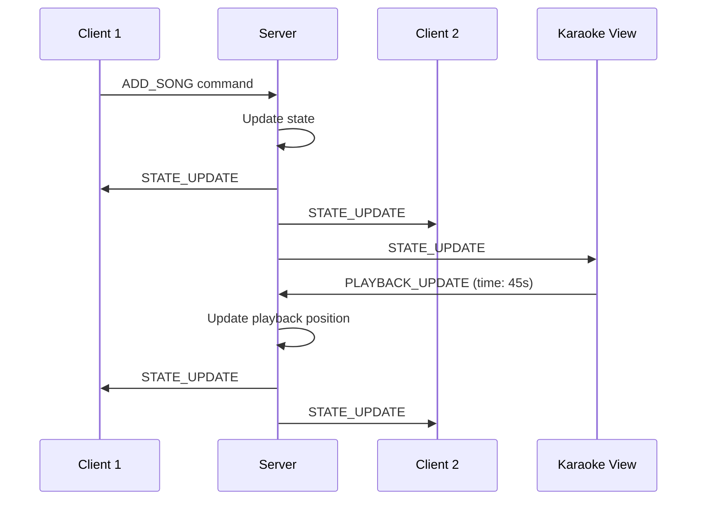
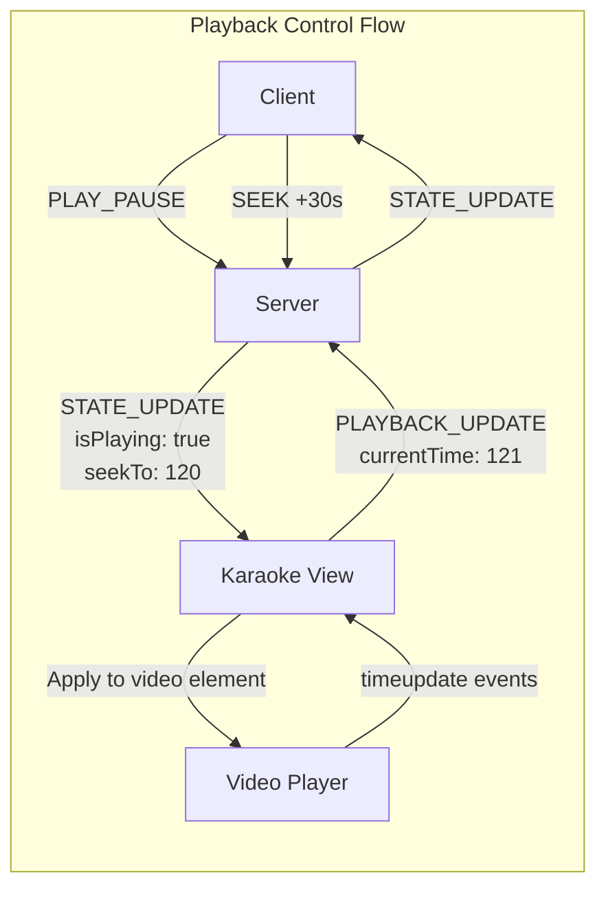
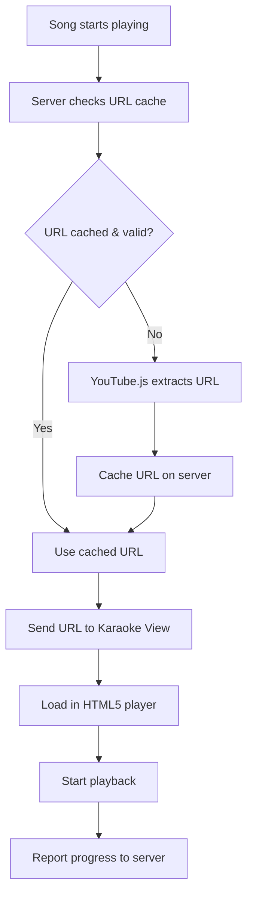

# YT-Kara Design Document

## Table of Contents
1. [Overview](#overview)
2. [Architecture](#architecture)
3. [Network Setup](#network-setup)
4. [Data Synchronization](#data-synchronization)
5. [API Design](#api-design)
6. [Data Models](#data-models)
7. [User Interface](#user-interface)
8. [Technical Implementation](#technical-implementation)
9. [Development Phases](#development-phases)
10. [File Structure](#file-structure)

## Overview

A simple karaoke webapp for parties where the host TV/projector plays YouTube videos while friends control the queue from their phones.

### Key Features
- Server manages all state (single source of truth)
- WebSocket for real-time updates
- Plays any YouTube video (no iframe restrictions)
- Clean HTML5 video player
- Works on local network only
- Simple one-time setup

### Design Principles
1. Keep it simple - server handles complexity, clients just display
2. Local network only - no external dependencies
3. Server owns all state - avoids sync conflicts
4. Minimal setup - just Node.js

## Architecture



### Components

1. **Backend Server (Node.js)**
   - **State Management**: Single source of truth for all session state
   - **Queue Management**: Handles all playlist operations atomically
   - **Client Management**: Tracks connected clients and permissions
   - **YouTube Integration**: Extracts video URLs via YouTube.js
   - **WebSocket Server**: Real-time bidirectional communication
   - **Static File Serving**: Hosts the web application
   - **History & Statistics**: Persists across sessions

2. **Karaoke View (TV/Projector)**
   - Thin client - just displays what server tells it
   - Renders video player
   - Shows current queue state from server
   - Displays connection QR code
   - Sends playback events to server (play/pause/seek)

3. **Client View (Mobile)**
   - Thin client - pure UI layer
   - Sends commands to server (add song, skip, etc.)
   - Renders server state updates
   - No local state management

4. **Benefits of Backend-Centric Design**
   - **No synchronization complexity**: Server is single source of truth
   - **Perfect consistency**: Impossible to have conflicting states
   - **Instant recovery**: Refresh page, get exact state back
   - **Simpler clients**: Just render what server sends
   - **Easier debugging**: All logic in one place

## Network Setup

### Connection Flow



### Host Setup
1. Install Node.js (one-time)
2. Run `npm install` in project directory (one-time)
3. Start server: `npm start`
4. Server displays local IP address in console
5. Open browser to `http://localhost:8080` (or the displayed IP)

### Client Connection
1. Scan QR code displayed on karaoke screen
2. Or manually enter: `http://[HOST-IP]:8080/client`

## Data Synchronization

### WebSocket Architecture

All clients connect to the backend via WebSocket for real-time communication. The server broadcasts state changes to all connected clients whenever something changes (song added, playback started, etc.).

### Message Flow



### Command Types (Client → Server)

| Command | Description | Payload |
|---------|-------------|---------|
| `ADD_SONG` | Add song to queue | `{ videoId, clientId }` |
| `REMOVE_SONG` | Remove from queue | `{ queueId }` |
| `REORDER_QUEUE` | Change song position | `{ fromIndex, toIndex }` |
| `SKIP_SONG` | Skip current song | `{}` |
| `SEEK` | Seek to position | `{ time }` |
| `PLAY_PAUSE` | Toggle playback | `{ isPlaying }` |
| `SEARCH` | Search for songs | `{ query }` |

### Event Types (Server → Client)

| Event | Description | Payload |
|-------|-------------|---------|
| `STATE_UPDATE` | Full state sync | `{ state: SessionState }` |
| `SEARCH_RESULTS` | Search results | `{ results: [...] }` |
| `CLIENT_JOINED` | New client connected | `{ client }` |
| `CLIENT_LEFT` | Client disconnected | `{ clientId }` |
| `ERROR` | Error occurred | `{ message }` |

### State Management

- **Server Memory**: All active session state
- **Server Disk**: History and statistics (SQLite)
- **Client**: No persistent state, just renders server state
- **Recovery**: Clients reconnect and receive full state

### Playback Control Architecture

The server tracks the intended playback state, while the Karaoke View browser controls the actual video element:



**Control Flow:**

1. **Any client** can send playback commands (play, pause, seek, skip)
2. **Server** updates its state and broadcasts to all connected clients
3. **Karaoke View** receives state updates and applies them to the HTML5 video element
4. **Video player** sends periodic progress updates back to server (every second)
5. **Server** broadcasts current playback position to keep all clients synchronized

**Key Design Decisions:**

- **Server as coordinator**: Server doesn't play video, just coordinates state
- **Karaoke View as player**: The TV/projector browser handles actual video playback
- **Periodic sync**: Video progress reported every second to avoid flooding
- **Seek operations**: Server sends special "seekTo" flag to trigger immediate seek
- **Buffering handling**: Karaoke View reports buffering state to server

This architecture ensures perfect synchronization while keeping the server lightweight and the clients simple.

## API Design

### HTTP Endpoints (REST)

| Endpoint | Method | Description | Response |
|----------|--------|-------------|----------|
| `/api/video/:id` | GET | Get video stream URL | `VideoInfo` |
| `/api/stats` | GET | Get session statistics | `Statistics` |
| `/api/history` | GET | Get play history | `HistoryItem[]` |

### WebSocket API

The primary API is WebSocket-based for real-time communication. HTTP endpoints are only used for:
- Getting video stream URLs (called by Karaoke View)
- Retrieving statistics and history (optional features)

All queue management, search, and playback control happens via WebSocket messages (see Data Synchronization section).

## Data Models

### Core Models

**SessionState** - The complete state managed by the server:
- `queue`: Array of songs waiting to play
- `currentSong`: Currently playing song (null if none)
- `currentTime`: Current playback position in seconds
- `isPlaying`: Whether video is playing or paused
- `clients`: Connected clients list
- `history`: Recently played songs

**QueueItem** - A song in the queue:
- `id`: Unique identifier for queue operations
- `videoId`: YouTube video ID
- `title`: Song title
- `thumbnail`: Thumbnail URL
- `duration`: Length in seconds
- `addedBy`: Client who added it
- `addedAt`: Timestamp when added

**Client** - A connected user:
- `id`: Unique client identifier
- `name`: Display name (auto-generated or custom)
- `type`: 'host' | 'guest'
- `connectedAt`: Connection timestamp

**VideoInfo** - Video playback information:
- `url`: Direct stream URL from YouTube
- `expiresAt`: When URL expires (typically 6 hours)
- `quality`: Video quality options available

### Simplified State Management

With the backend-centric design, data models are simpler:
- No need for conflict resolution models
- No client-side state copies
- No synchronization metadata
- Server handles all state transitions atomically

## User Interface

### Karaoke View (TV/Projector)

```
┌──────────────────────────────────────────────────────────┐
│                                                    [QR]   │
│  ┌──────────────────────────────────────┬─────────────┐  │
│  │                                        │  Next Up:  │  │
│  │                                        │             │  │
│  │                                        │ 1. Song A   │  │
│  │         Video Player (90%)             │ 2. Song B   │  │
│  │                                        │ 3. Song C   │  │
│  │                                        │             │  │
│  │                                        │             │  │
│  └──────────────────────────────────────┴─────────────┘  │
│  ┌──────────────────────────────────────────────────────┐ │
│  │  ♪ Bohemian Rhapsody - Queen          ████████░░ 4:32 │ │
│  └──────────────────────────────────────────────────────┘ │
└──────────────────────────────────────────────────────────┘
```

**Features:**
- Full-screen video playback
- Minimal UI overlay
- Auto-hiding controls
- Next songs preview
- QR code for joining (collapsible)
- Current song info and progress

### Client View (Mobile)

```
┌─────────────────────────┐
│ 🎤 YT-Kara              │
├─────────────────────────┤
│ [Search] [Queue] [History] │
├─────────────────────────┤
│ 🔍 Search songs...      │
├─────────────────────────┤
│ ┌─────────────────────┐ │
│ │ [Thumbnail]         │ │
│ │ Song Title          │ │
│ │ Artist • 4:32       │ │
│ │          [+ Add]    │ │
│ └─────────────────────┘ │
│ ┌─────────────────────┐ │
│ │ [Thumbnail]         │ │
│ │ Another Song        │ │
│ │ Artist • 3:21       │ │
│ │          [+ Add]    │ │
│ └─────────────────────┘ │
├─────────────────────────┤
│ [⏯️ Play] [⏭️ Skip] [🔊] │
└─────────────────────────┘
```

**Features:**
- Tab-based navigation
- Instant search with suggestions
- Touch-friendly controls
- Drag-to-reorder queue
- Swipe gestures
- Responsive design

## Technical Implementation

### Video Playback Strategy



### Server-Side Caching

The backend handles all caching:

1. **Stream URLs**: Cached for 5 hours (YouTube URLs expire after ~6 hours)
2. **Search Results**: Cached for 1 hour
3. **Video Metadata**: Cached for 24 hours
4. **Thumbnails**: URLs cached indefinitely

### Connection Management

- **WebSocket heartbeat**: Ping every 30 seconds to detect disconnects
- **Auto-reconnect**: Clients retry connection if disconnected
- **State recovery**: Server sends full state when client reconnects

### Error Handling

- **Video unavailable**: Server skips to next song automatically
- **URL expired**: Server fetches new URL transparently
- **Client disconnect**: Server maintains state, client reconnects
- **Server restart**: State persisted to disk, restored on startup

## Development Phases

### Phase 1: MVP Backend
- [x] Design document
- [ ] Basic Node.js server with Express
- [ ] WebSocket setup
- [ ] YouTube.js integration for URL extraction
- [ ] Simple state management (queue, current song)

### Phase 2: MVP Frontend
- [ ] Basic karaoke view with HTML5 video player
- [ ] Basic client view with search and queue
- [ ] WebSocket client connection
- [ ] QR code for connection

### Phase 3: Core Features
- [ ] Queue management (add, remove, reorder)
- [ ] Playback controls (play/pause/skip/seek)
- [ ] Auto-advance to next song
- [ ] URL caching

### Phase 4: Polish
- [ ] Better error handling
- [ ] Reconnection logic
- [ ] Responsive mobile UI
- [ ] Smooth transitions

### Future Ideas
- [ ] Voting to skip songs
- [ ] Play history
- [ ] Favorite songs
- [ ] Better search filters

## File Structure

```
yt-kara/
├── server/
│   ├── index.js           # Express + WebSocket server
│   ├── state.js           # Session state management
│   ├── youtube.js         # YouTube.js integration
│   ├── websocket.js       # WebSocket message handling
│   ├── cache.js           # URL and data caching
│   └── package.json       # Backend dependencies
├── public/
│   ├── index.html         # Karaoke view (TV)
│   ├── client.html        # Client view (mobile)
│   ├── css/
│   │   ├── karaoke.css   # TV display styles
│   │   ├── client.css    # Mobile styles
│   │   └── common.css    # Shared styles
│   ├── js/
│   │   ├── karaoke.js    # Karaoke view logic
│   │   ├── client.js     # Client view logic
│   │   ├── websocket.js  # WebSocket client
│   │   ├── player.js     # Video player wrapper
│   │   └── utils.js      # Helper functions
│   └── lib/
│       └── qrcode.min.js # QR code generator
├── design/
│   ├── features.md       # Feature requirements
│   └── doc.md           # This document
├── package.json         # Root package.json
└── README.md           # Setup instructions
```

## Security Considerations

1. **Local Network Only**: No external access by default
2. **No User Data**: No accounts or personal information stored
3. **Read-Only YouTube**: Only fetches public video data
4. **Input Sanitization**: All user inputs sanitized
5. **Rate Limiting**: Prevent API abuse

## Performance Targets

- **Search Response**: < 500ms
- **Video Load Time**: < 2 seconds
- **Sync Latency**: < 100ms
- **UI Responsiveness**: 60 FPS
- **Memory Usage**: < 100MB per client

## Success Metrics

1. **Quick setup**: < 2 minutes to get running
2. **Works with any YouTube video**
3. **No lag between devices**
4. **Clean video player (no YouTube UI)**
5. **Doesn't crash during a party**

## Conclusion

This design uses a simple backend-centric approach where the server manages all state and clients just display it. This avoids the complexity of trying to sync state across browsers.

The backend handles:
- State management and queue operations
- YouTube video URL extraction
- WebSocket communication
- Caching

The clients are kept simple:
- Send commands to server
- Display what server tells them
- Control video playback

This meets the requirements:
- ✅ Plays all YouTube videos (using YouTube.js)
- ✅ Custom video player (no YouTube iframe)
- ✅ Simple setup (just Node.js)
- ✅ Multi-device sync (WebSocket)
- ✅ Local network only
- ✅ Server manages state (no sync conflicts)